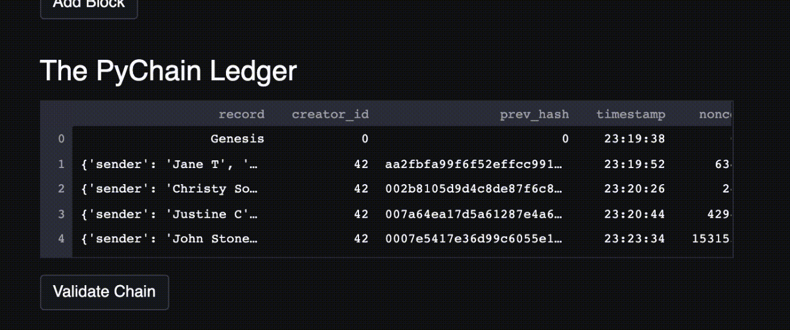

# Module 18 Challenge: PyChain Ledger

## Table of Contents

[PyChain Ledger Overview](https://github.com/juzcho/Module_18_Challenge_PyChain_Ledger#pychain-ledger-overview)

[Technologies](https://github.com/juzcho/Module_18_Challenge_PyChain_Ledger#technologies)

[Installation Guide](https://github.com/juzcho/Module_18_Challenge_PyChain_Ledger#installation-guide)

[Examples](https://github.com/juzcho/Module_18_Challenge_PyChain_Ledger#examples)

[Usage](https://github.com/juzcho/Module_18_Challenge_PyChain_Ledger#usage)

[Contributors](https://github.com/juzcho/Module_18_Challenge_PyChain_Ledger#contributors)

[License](https://github.com/juzcho/Module_18_Challenge_PyChain_Ledger#license)

---

## PyChain Ledger Overview

This project is about creating a streamlit application called PyChain ledger to record the transaction data into a blockchain without the option to delete any block from the ledger but instead continue to add data to the block. It would also test the validity of the blockchain and create a dataframe that would show the list of transaction inside the blockchain. 

---

## Technologies

This project leverages **[python version 3.8.5](https://www.python.org/downloads/)** with the following packages and modules:

* [pandas](https://pandas.pydata.org/docs/) - *version 1.3.2* - This was used to be able to easily manipulate dataframes and create dataframes.

* [Streamlit](https://streamlit.io/) - *version 0.84.2* - To be able to view the application into a web browser and that users can interact with the ledger.

* [Data Classes](https://docs.python.org/3/library/dataclasses.html) -This module provides a decorator and functions for automatically adding generated special methods to classes, which managed us to use class blocks into our code structure.

* [datetime](https://docs.python.org/3/library/datetime.html) - While date and time arithmetic is supported, the focus of the implementation is on efficient attribute extraction for output formatting and manipulation. In our case, we used this to be able to determine the UTC timezoon to create a time stamp in our blockchain.

* [typing](https://docs.python.org/3/library/typing.html)- This allows us to use the most fundamental support consisting of the types Any, Union, Tuple, Callable, TypeVar, and Generic.

* [hashlib](https://docs.python.org/3/library/hashlib.html)- This module implements a common interface to many different secure hash and message digest algorithms. In our application, we use SHA256 to return a hexdigest.

---
## Installation Guide

### 1. Install the application, Streamlit into your dev environment:

`pip install streamlit`

### 2. Use VSCODE to view and edit pychain.py file.

---
## Examples

Here are some of the data we did for this model.

### **This gif should show how to use the Pychain ledger application:** 

---

## Usage

### To use the Streamlit Application:

1. Go to your terminal and direct your folder to where the file for our pychain.py is located. Then on your terminal, type the following:

    `streamlit run pychain.py` 

This should open up a new internet browser automatically, then it will allow you to interact with the text boxes to input your sender, receiver and amount.

---

## Contributors

Contributed by: Justine Cho

Email: juz317_cho@yahoo.com

[ LinkedIn](https://www.linkedin.com/in/justinecho)

---

## License

### **MIT License**

Copyright (c) [2021] [Justine Cho]

Permission is hereby granted, free of charge, to any person obtaining a copy
of this software and associated documentation files (the "Software"), to deal
in the Software without restriction, including without limitation the rights
to use, copy, modify, merge, publish, distribute, sublicense, and/or sell
copies of the Software, and to permit persons to whom the Software is
furnished to do so, subject to the following conditions:

The above copyright notice and this permission notice shall be included in all
copies or substantial portions of the Software.

THE SOFTWARE IS PROVIDED "AS IS", WITHOUT WARRANTY OF ANY KIND, EXPRESS OR
IMPLIED, INCLUDING BUT NOT LIMITED TO THE WARRANTIES OF MERCHANTABILITY,
FITNESS FOR A PARTICULAR PURPOSE AND NONINFRINGEMENT. IN NO EVENT SHALL THE
AUTHORS OR COPYRIGHT HOLDERS BE LIABLE FOR ANY CLAIM, DAMAGES OR OTHER
LIABILITY, WHETHER IN AN ACTION OF CONTRACT, TORT OR OTHERWISE, ARISING FROM,
OUT OF OR IN CONNECTION WITH THE SOFTWARE OR THE USE OR OTHER DEALINGS IN THE
SOFTWARE.
